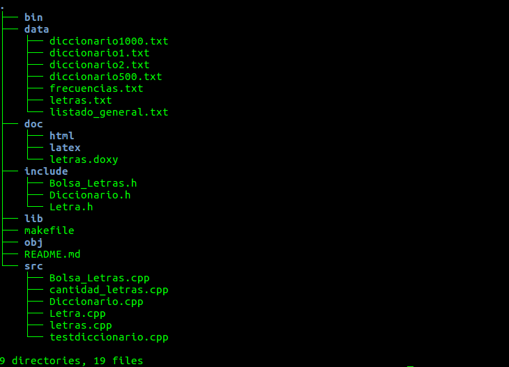

# Scrabble

> Por: Mapachana

## Restricciones

- Este scrabble no admite letras con tilde, ñ o ç.

- Todas las palabras del diccionario que se le pasen al scrabble deben estar en minúscula.

- Ha sido probado con g++ 5.4.0 con el estándar c++11.

## Estructura

La estructura del proyecto es la siguiente:



> Resultado de la orden tree en la carpeta raíz del proyecto.

Se ha seguido la estructura genérica de carpetas del curso.

### data

En la carpeta **data** se recogen:

- Los diccionarios dados en el material de la práctica: _diccionario1.txt_, _diccionario2.txt_, _diccionario500.txt_, _diccionario1000.txt_.

- Diccionario con más de 10000 palabras del español al que se le han eliminado las tildes, ñ, ç y mayúsculas: listado_general.txt .

- Ficheros _letras.txt_ y _frecuencias.txt_ que se generan en cada ejecución del programa Scrabble ya que dependen del diccionario (pueden eliminarse).

### src

Ficheros fuente, donde están las implementaciones de las clases y los ficheros principales de los programas.

### include

Archivos de cabecera de las clases.

### doc

Donde se guarda la documentación al generarla con el archivo _letras.doxy_.

## Clases

He implementado tres clases: _Diccionario_, _Letra_ y *Bolsa_Letras*.

No he implementado la clase *Conjunto_Letras* ya que me parecía redundante con *Bolsa_Letras*, porque usando el campo _cantidad_ de la clase _Letra_ podía obtener las probabilidades y, por tanto, no necesitaba dos clases separadas en las que en una las letras no se repitieran y en la otra sí. Además la función principal de *Conjunto_Letras*, mantener el fichero Letras.txt en memoria, se puede llevar a cabo usando la clase *Bolsa_Letras*.

Por estos motivos, he prescindido de la clase *Conjunto_Letras* y la he "mezclado" con *Bolsa_Letras*.

### Diccionario

La clase **Diccionario** mantiene en memoria un fichero diccionario, que contiene las palabras que se permiten formar en el juego y genera los ficheros _letras.txt_ y _frecuencias.txt_.

#### iterator

Clase iterador del tipo diccionario.

### Letra

La clase **Letra** describe una letra, que tiene tres campos:

- letra: Caracter que representa la letra.

- cantidad: Numero de letras que hay en la bolsa de letras (depende del diccionario).

- puntos: Puntos que vale la letra (depende del diccionario).

La cantidad y puntos de cada letra se calcularán en otra clase.

### Bolsa_Letras

Esta clase se encarga de mantener todas las letras necesarias en memoria, calcular su cantidad y puntuación, generar las letras del jugador y buscar las soluciones del juego para ambos modos.

## Programas

### testdiccionario

Es una  pequeña prueba de la mayor parte de los métodos de diccionario.

### cantidad_letras

Prueba como genera un diccionario los ficheros letras.txt y frecuencias.txt.

### Scrabble

Programa principal, dadas unas letras busca las mejores puntuaciones de acuerdo a dos criterios: longitud o puntuación de las palabras.

En caso de que con las letras dadas no puedas encontrar ninguna solución válida, esto es, que se pueda formar con las letras dadas y que pertenezca al diccionario, se puede escribir *no_hay* para pasar turno y ver si había alguna solución o no.

## Makefile

### Compilación

Para compilar basta abrir una terminal y hacer `make` en el directorio raíz y se compilarán todos los módulos.

### Limpieza

Distinguimos entre dos limpiezas:

- `make clean` : Borra los archivos objeto de la carpeta **obj**.

- `make mrproper` : Borra los archivos objeto, los binarios y la documentación.

### Documentación

Para generar la documentación basta ejecutar `make documentacion` y se generará en la carpeta **doc** tanto en html como en LaTeX.

Para ello se usa el archivo *letras.doxy*.

## Ejemplos de uso

### testdiccionario

Para ejecutar este módulo la sintaxis es:

```shell
./bin/testdiccionario ./data/<diccionario>
```

Por ejemplo:

```shell
./bin/testdiccionario ./data/diccionario1000.txt
```

### cantidad_letras

Para ejecutar este módulo la sintaxis es:

```shell
./data/cantidad_letras ./data/<diccionario> ./data/<fichero_letras> ./data/<fichero_frecuencias>
```

Por ejemplo:

```shell
./data/cantidad_letras ./data/diccionario1000.txt ./data/letras.txt ./data/frecuencias.txt
```

### letras

Para ejecutar este módulo la sintaxis es:

```shell
./bin/letras ./data/<diccionario> ./data/<fichero_letras> <num> <P|L>
```

Donde:

- _num_ es el número de fichas aleatorias  que recibirá el jugador para jugar (Puede ir de 1 a 100).

- *P* es el modo por puntos, se buscará la mejor solución en función de los puntos de la palabra.

- *L* es el modo por longitud, la mejor solución será la palabra más larga posible.

Por ejemplo:

```shell
./bin/letras ./data/diccionario1000.txt ./data/letras.txt 8 P
```

```shell
./bin/letras ./data/diccionario1000.txt ./data/letras.txt 8 L
```

## Anotaciones

- En diversas partes del código se puede ver que he tomado como estándar que el juego tenga 100 fichas (variable *numfichas*). Esto ha sido así por simplicidad y porque la mayor parte de palabras del español no pasan de los cincuenta caracteres. Además, como la probabilidad de cada letra depende del diccionario formar una palabra larga es muy difícil por probabilidad.

- No he diseñado la clase diccionario para que acepte mayúsculas por simplicidad, pero si se quisiera bastaría hacer un tolower() en cada lectura del diccionario.


